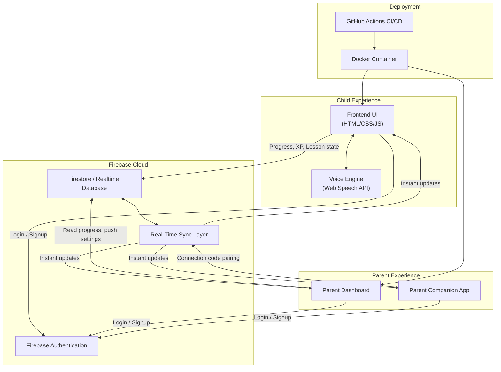
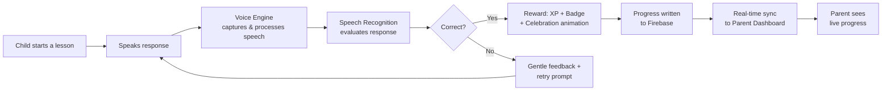
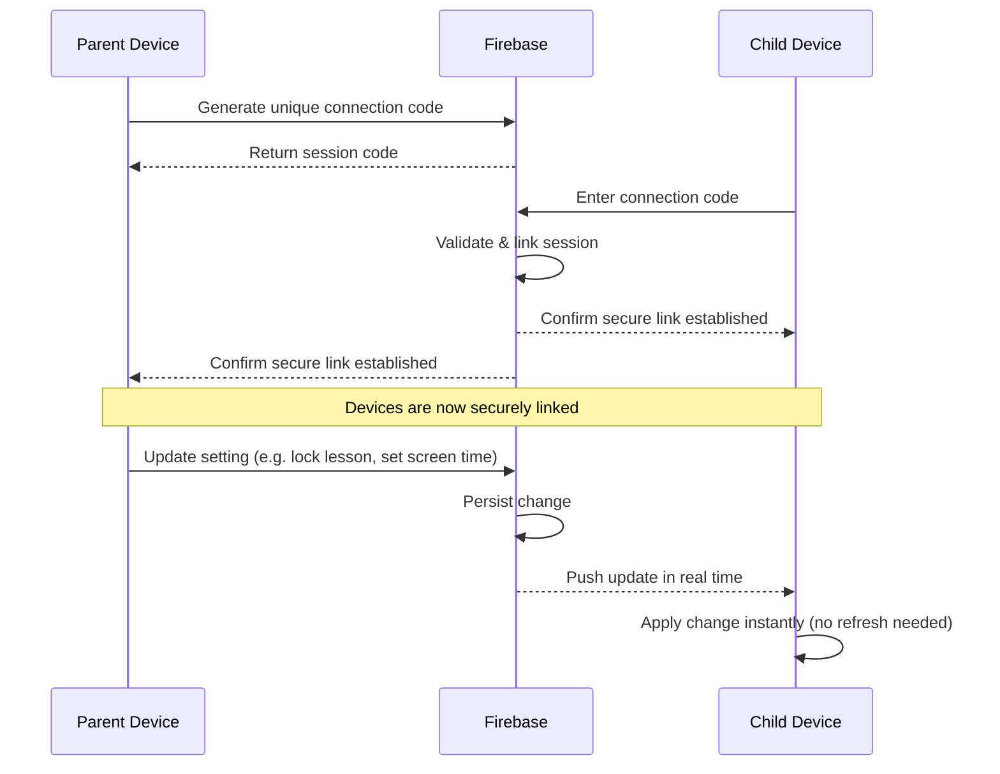

### AI-Powered, Voice-Driven, Gamified Learning Platform for Early Childhood Education

**Learn • Speak • Play • Grow**

BrainBerry turns early childhood learning into a spoken conversation. Instead of tapping through static screens, children aged 3–6 *talk* to the app, and the app talks back — in a natural, familiar Indian voice — guiding them through lessons, celebrating their progress, and keeping parents in the loop in real time.

[](https://firebase.google.com/)
[](#-voice-driven-learning)
[](#-deployment)
[](#-nep-2020-alignment)
[](#-license)

</div>

---

## Table of Contents

- [Vision](#-vision)
- [The Problem BrainBerry Solves](#-the-problem-brainberry-solves)
- [Core Features](#-core-features)
  - [Voice-Driven Learning](#-voice-driven-learning)
  - [Natural Indian Voice Narration](#-natural-indian-voice-narration)
  - [Remote Parent Linking](#-remote-parent-linking--our-signature-feature)
  - [Real-Time Synchronization](#-real-time-synchronization)
  - [Gamification System](#-gamification-system)
  - [Interactive Learning Modules](#-interactive-learning-modules)
  - [Parent Dashboard](#-parent-dashboard)
  - [Parent Companion App](#-parent-companion-app)
  - [Authentication & Security](#-authentication--security)
  - [Learning Progress System](#-learning-progress-system)
  - [AI Features](#-ai-features)
  - [Inclusivity & Accessibility](#-inclusivity--accessibility)
- [NEP 2020 Alignment](#-nep-2020-alignment)
- [Sustainable Development Goals](#-sustainable-development-goals-sdgs)
- [Technology Stack](#-technology-stack)
- [Architecture](#-architecture)
- [Folder Structure](#-folder-structure)
- [Project Workflow](#-project-workflow)
- [Remote Linking Workflow](#-remote-linking-workflow)
- [Installation Guide](#-installation-guide)
- [Environment Variables](#-environment-variables)
- [Deployment](#-deployment)
- [Why BrainBerry Is Different](#-why-brainberry-is-different)
- [Use Cases](#-use-cases)
- [Roadmap](#-roadmap)
- [Impact](#-impact)
- [Demo Video](#-demo-video)
- [FAQ](#-faq)
- [Contributing](#-contributing)
- [Team BrainBerry](#-team-brainberry)
- [License](#-license)
- [Support BrainBerry](#-support-brainberry)

---

## Vision

BrainBerry exists to close the gap between education and genuine engagement. Most early-learning apps ask a child to look and tap; BrainBerry asks a child to **speak, listen, and play**. That single shift — from passive tapping to active conversation — changes how a 3-to-6-year-old relates to learning.

The platform is built around four commitments:

| Commitment | What it means in practice |
|---|---|
| **Accessible** | Voice-first design lowers the barrier for children who can't yet read fluently or navigate complex UI |
| **Engaging** | Every lesson is wrapped in gamification — XP, badges, rewards, celebrations |
| **Inclusive** | Built with learning differences, speech delays, and varying learning speeds in mind |
| **Personalized** | Parents (and eventually the AI itself) tailor the experience to each child |

BrainBerry aligns with India's **NEP 2020** and contributes directly to **UN SDG 4 – Quality Education**, alongside several other SDGs detailed below.

---

## The Problem BrainBerry Solves

Most traditional early-learning apps share the same weaknesses:

- Passive, tap-only learning with no real interaction
- No personalization to a child's pace or ability
- No meaningful parental supervision or control
- Weak, shallow engagement mechanics
- English-only content that ignores native-language learners
- Limited accessibility for children with learning differences
- Poor or superficial gamification
- No real-time synchronization between devices
- No adaptive learning that responds to how a child is actually doing

BrainBerry was built specifically to address every item on this list — through voice interaction, Firebase-powered real-time sync, a dedicated parent control system, native-language modules, and a gamification layer that makes learning feel like play rather than schoolwork.

---

## Core Features

### Voice-Driven Learning

The foundation of BrainBerry. Children don't just tap answers — they **speak** them.

- Speech-recognition-powered lessons
- Speak-and-learn activities across every module
- Pronunciation practice with feedback
- Interactive voice responses that keep the lesson conversational
- Hands-free interaction designed for children who aren't yet comfortable with complex touch UI

### Natural Indian Voice Narration

One of BrainBerry's strongest differentiators. Rather than relying on generic, robotic text-to-speech, BrainBerry narrates lessons in a **natural Indian voice** — making the experience feel familiar, warm, and culturally relevant to Indian children rather than foreign and mechanical. This single design choice materially changes how comfortable and engaged children feel during a session.

### Remote Parent Linking — Our Signature Feature

> This is the feature that sets BrainBerry apart from virtually every other early-learning app on the market.

Parents can securely connect to their child's device **remotely**, using a unique connection code — no shared device, no physical proximity required.

Once linked, a parent can:

- Monitor learning progress in real time
- View detailed learning statistics
- Receive updates as the child completes lessons
- Enable or disable specific lessons
- Lock or unlock activities remotely
- Control screen time
- Push settings changes that sync **instantly** to the child's device

All of this is powered by **Firebase real-time synchronization** — when a parent changes a setting, it reflects on the child's device essentially immediately, with no manual refresh or re-login required.

### Real-Time Synchronization

BrainBerry keeps the following in sync across every connected device, instantly, via Firebase:

- Lesson progress
- Lesson lock/unlock status
- Parent-configured settings
- User/profile data

### Gamification System


Learning is wrapped in game mechanics so it *feels* like play:

- XP points for completed activities
- Reward coins
- Achievement badges
- Progress tracking and learning milestones
- Interactive challenges
- Animated celebrations on lesson completion
- Unlockable content as positive reinforcement

### Interactive Learning Modules


Every module below combines voice, animation, interaction, and gamification:

| Module | What a child learns |
|---|---|
|**Magic of Words** | Vocabulary building, word recognition, listening & speaking exercises |
|**Numbers** | Counting, number identification, interactive number activities |
|**Golden Words & Sentences** | Daily-use vocabulary, sentence formation, communication skills |
|**Civic Sense** | Basic social values, good habits, community awareness |
|**Colours & Shapes** | Colour recognition, shape identification, interactive visual learning |
|**Colour Mixing Lab** | Real-time colour-mixing animations, primary/secondary colours, voice-guided experiments |
|**Animals World** | Animal identification, animal sounds, interactive exploration |
|**Hindi — स्वर (Vowels)** | Hindi alphabet learning, pronunciation guidance, voice validation |
|**Hindi — व्यंजन (Consonants)** | Character recognition, speaking practice, interactive flashcards |

### Parent Dashboard


A dedicated control center that gives parents real oversight of their child's learning:

-  Screen time management
-  Lesson assignment controls
-  Progress monitoring
-  Learning analytics
-  Lesson lock/unlock system
-  Real-time learning tracking
-  Remote child management

### Parent Companion App

Parents don't need to sit at the child's device to stay involved:

- Login using email & password
- Secure connection-code pairing (see [Remote Linking Workflow](#-remote-linking-workflow))
- Real-time dashboard synchronization
- Remote lesson management
- Progress tracking
- Screen time controls
- Instant updates across every connected device

### Authentication & Security

- Firebase Authentication for secure login and signup
- Session management
- Protected, user-specific data storage
- User-specific learning profiles, isolated per account

### Learning Progress System

- Lesson completion tracking
- XP progress monitoring
- Learning history
- Achievement tracking
- Personalized progress dashboard for both child and parent views

### AI Features

**Available today:**
- Speech recognition
- Voice command handling
- Interactive, real-time feedback during lessons

**On the roadmap:**
- AI learning assistant
- Personalized learning paths
- Adaptive difficulty system
- Learning recommendations based on performance
- AI-powered progress analysis

### Inclusivity & Accessibility

Accessibility isn't a feature bolted on afterward — it's a core design philosophy. BrainBerry's voice-first approach is specifically valuable for:

- Children with learning difficulties
- Children with speech delays
- Children who learn at different speeds
- Neurodiverse learners
- Early childhood education broadly, where reading fluency can't be assumed

---

## 🇮🇳 NEP 2020 Alignment

BrainBerry is deliberately designed around India's **National Education Policy 2020**:

| NEP 2020 Pillar | How BrainBerry Delivers It |
|---|---|
| **Foundational Literacy & Numeracy** | Reading skills, vocabulary development, and number learning through the Numbers and Magic of Words modules |
| **Multilingual Education** | Dedicated Hindi learning modules (स्वर and व्यंजन) alongside native-language support |
| **Experiential & Play-Based Learning** | Every lesson is activity-based and gamified rather than passive |
| **Digital Education** | The entire platform is a technology-enhanced learning environment |
| **Holistic Development** | Modules span language, cognitive skills, and creativity (e.g. the Colour Mixing Lab) |

---

## Sustainable Development Goals (SDGs)

<table>
<tr><td width="90" align="center"></td><td><b>SDG 4 — Quality Education</b><br/>Makes early education more engaging, inclusive, and accessible through voice-first, gamified learning.</td></tr>
<tr><td width="90" align="center"></td><td><b>SDG 9 — Industry, Innovation & Infrastructure</b><br/>Applies AI, speech recognition, and real-time cloud infrastructure to modernize early education.</td></tr>
<tr><td width="90" align="center"></td><td><b>SDG 10 — Reduced Inequalities</b><br/>Supports learners from diverse backgrounds and abilities, including children with learning differences.</td></tr>
<tr><td width="90" align="center"></td><td><b>SDG 11 — Sustainable Communities</b><br/>Promotes cultural and language preservation through native-language modules like Hindi learning.</td></tr>
<tr><td width="90" align="center"></td><td><b>SDG 3 — Good Health & Well-Being</b><br/>Reduces learning-related stress by making education feel enjoyable rather than pressured.</td></tr>
</table>

---

## Technology Stack

> **Note:** This table reflects the confirmed, current implementation. Some items discussed in early planning docs (e.g. React/TypeScript, Node/Express, Python AI services, AWS) are marked *"planned / if applicable"* rather than shipped, to keep this README accurate to the actual codebase.

| Layer | Technology |
|---|---|
| **Frontend** | HTML5, CSS3, JavaScript |
| **Voice Processing** | Web Speech API, Speech Recognition API |
| **Backend / Data** | Firebase Authentication, Firebase Realtime Database / Firestore |
| **Synchronization** | Firebase real-time listeners (parent ↔ child sync) |
| **Deployment** | Docker, GitHub Actions (CI/CD), cloud-hosting ready |
| **Planned / if applicable** | React + TypeScript frontend migration, Node.js/Express services, Python-based AI modules, AWS hosting |

---

## Architecture



---

## 📁 Folder Structure

> Adjust paths below to match your actual repository layout — structure shown reflects the typical BrainBerry project organization.

```
BrainBerry/
├── frontend/                  # Child-facing learning application
│   ├── src/
│   │   ├── components/        # Reusable UI components (lesson cards, buttons, animations)
│   │   ├── modules/           # Individual learning modules
│   │   │   ├── magic-of-words/
│   │   │   ├── numbers/
│   │   │   ├── golden-words/
│   │   │   ├── civic-sense/
│   │   │   ├── colours-shapes/
│   │   │   ├── colour-mixing-lab/
│   │   │   ├── animals-world/
│   │   │   └── hindi/
│   │   │       ├── swar/
│   │   │       └── vyanjan/
│   │   ├── voice/              # Speech recognition & voice interaction logic
│   │   ├── gamification/       # XP, badges, rewards, celebration animations
│   │   ├── firebase/           # Firebase config & client setup
│   │   └── assets/             # Images, audio, icons
│   └── public/
│
├── parent-dashboard/           # Parent-facing web dashboard
│   ├── src/
│   │   ├── components/
│   │   ├── sync/                # Real-time sync listeners
│   │   └── analytics/           # Progress & learning analytics views
│   └── public/
│
├── parent-app/                 # Parent companion mobile/web app
│   └── src/
│       ├── auth/
│       ├── pairing/             # Connection-code pairing logic
│       └── controls/            # Remote lesson & screen-time controls
│
├── docker/
│   ├── Dockerfile
│   └── docker-compose.yml
│
├── .github/
│   └── workflows/               # GitHub Actions CI/CD pipelines
│
├── .env.example
├── README.md
└── LICENSE
```

---

## Project Workflow



---

## Remote Linking Workflow



**How it works, step by step:**

1. Parent generates a unique connection code from the Parent Companion App.
2. The code is entered on the child's device.
3. Firebase validates the code and securely links the two devices.
4. All relevant settings synchronize automatically.
5. From that point on, any change the parent makes reflects on the child's device in real time.

---

## Installation Guide

## Prerequisites

Before you begin, ensure the following are installed:

- Git
- Git LFS
- Docker
- Docker Compose

---

## 1. Clone the Repository

```bash
git clone https://github.com/<your-username>/BrainBerry.git
cd BrainBerry
```

---

## 2. Download Git LFS Assets

```bash
git lfs pull
```

> **Note:** BrainBerry uses Git LFS to manage large assets. Make sure all LFS files are downloaded before starting the application.

---

## 3. Start BrainBerry

```bash
docker compose up --build
```

---

## 4. Open the Application

Visit:

```
http://localhost:8080
```

---

## Stop the Application

```bash
docker compose down
```

---

## Why BrainBerry Is Different

| # | Differentiator | Why it matters |
|---|---|---|
| 1 | **Voice-first learning** | Children speak, not just tap — learning becomes conversational |
| 2 | **Natural Indian voice narration** | Familiar, warm narration instead of robotic TTS |
| 3 | **Remote parent linking** | Real supervision without needing the same physical device |
| 4 | **Real-time Firebase sync** | Parent changes apply instantly, with no manual refresh |
| 5 | **Deep gamification** | XP, badges, coins, and celebrations make learning feel like play |
| 6 | **Native-language modules** | Dedicated Hindi learning alongside English content |
| 7 | **NEP 2020 alignment** | Built around India's actual education policy priorities |
| 8 | **Accessibility-first design** | Built with learning differences and speech delays in mind |
| 9 | **Docker-based deployment** | Portable, reproducible deployment across environments |
| 10 | **Modern, animated UI** | Designed specifically for a young, attention-limited audience |

---

## Use Cases

- Early childhood education at home
- Interactive learning centers
- School learning programs
- Language development, especially Hindi
- Foundational literacy & numeracy programs
- Broader digital learning ecosystems for young children

---


## Impact

BrainBerry helps children:

- Learn through speaking and listening, not just tapping
- Build confidence through conversational interaction
- Stay engaged through meaningful gamification
- Strengthen foundational literacy and numeracy
- Develop language and communication skills, including in Hindi
- Learn inside a safe, enjoyable digital environment their parents can actually see into

---

## Demo Video

▶️ **Watch BrainBerry in action:** [YouTube Demo](https://youtu.be/FpWfL9s2y6Y?si=YVYn7YlBIvXL_NKq)

---

## Live Demo

**Application:** http://13.201.173.106:8080/
**Hosted on:** Amazon Web Services (AWS)

---

## FAQ

<details>
<summary><b>What age group is BrainBerry designed for?</b></summary>
<br/>
Primarily children aged 3–6, with design choices (voice-first interaction, minimal reliance on reading) that also support learners with different abilities and learning speeds.
</details>

<details>
<summary><b>Does BrainBerry work offline?</b></summary>
<br/>
The app is designed to minimize internet dependency where possible, synchronizing with Firebase once connectivity is available.
</details>

<details>
<summary><b>How does the parent-child linking actually work?</b></summary>
<br/>
A parent generates a unique connection code from the Parent Companion App; entering that code on the child's device securely links the two through Firebase, after which settings sync in real time. See <a href="#-remote-linking-workflow">Remote Linking Workflow</a> for the full sequence.
</details>

<details>
<summary><b>Is my child's data secure?</b></summary>
<br/>
Authentication and data storage are handled through Firebase Authentication and Firestore/Realtime Database, with user-specific, protected learning profiles.
</details>

<details>
<summary><b>Can I contribute a new learning module?</b></summary>
<br/>
Yes — see <a href="#-contributing">Contributing</a> below for how to propose and submit new modules.
</details>

---


## Team BrainBerry

| Name |
|---|
| Darshan Jayant Nerkar |
| Saurav Gajanan Patil |
| Parag Bharat Watane |
| Avishkar Vijay Kapadnis |

---

## License

Copyright © 2026 BrainBerry Team.

**All Rights Reserved.**

This repository is provided for viewing purposes only. No permission is granted to copy, modify, distribute, or use any part of this project without prior written consent from the BrainBerry Team.

---

## Support BrainBerry

If you believe in transforming early education through technology, consider giving this repository a ⭐ — and check out the star history below.

**BrainBerry — Where Learning Becomes an Adventure.**

</div>
